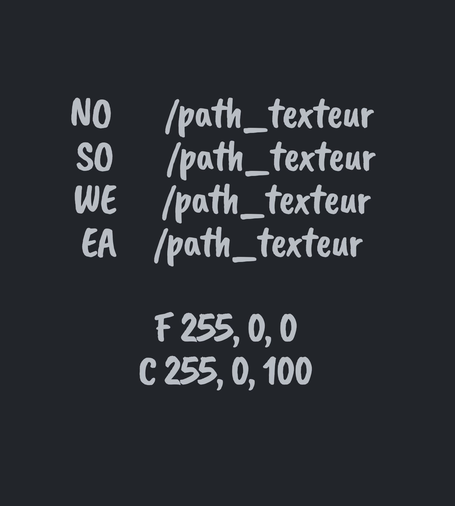

# Cub3D-42-cursus.

This project is inspired by the world-famous eponymous 90's game, which was the first FPS ever. It will enable you to explore ray-casting. Your goal will be to make a dynamic view inside a maze, in which you'll have to find your way.
<h3>
Mini_parsing
</h3>

in the parsing consisting of the following part:

<ul>
<li>
<h6>First :</h6>

&emsp;&emsp;&emsp;thing is check path of map and type file is ".cub"

</li>
<li>
<h6>Second :</h6>
	

	&emsp;&emsp;&emsp;check the compass "NO,EA,WE,SO" and floor & celling and our color (r,g,b) like this:
	

	N.B : order is not important

</li>
<li>
<h6>
Third :
</h6>

parsing map this is really imporant because you will check thing like : wall not close, not player, map must be int the last thing in the file or found more then one player exemple : 

</li>
</ul>

<h3>Draw Mini-map</h3>

to use minilibx in this project check this Doc of <a href="https://harm-smits.github.io/42docs/libs/minilibx/getting_started.html">MLX42</a> and get something link this:

